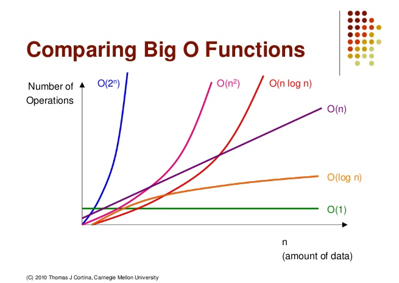

# 시간 복잡도 (Time Complexity)
## 복잡도란?
* 복잡도(Complexity)는 알고리즘의 성능을 나타내는 척도이다.
* 복잡도는 **시간 복잡도**와 **공간 복잡도**로 나눌 수 있다.
> 시간 복잡도
>* 알고리즘을 위해 필요한 연산횟수
>* 특정한 크기의 입력에 대하여 알고리즘이 얼마나 오래 걸리는지를 의미한다.

> 공간 복잡도
>* 알고리즘을 위해 필요한 메모리의 양
>* 특정한 크기의 입력에 대하여 알고리즘이 얼마나 많은 메모리를 차지하는지를 의미한다.

* 메모리가 발전함에 따라 공간 복잡도보단 시간 복잡도를 고려해야할 일이 많아졌다.
* 따라서 이번엔 시간 복잡도에 대해서만 공부를 해보려고 한다.

## 시간 복잡도
* 시간 복잡도를 표기하는 방법에는 Big-O(빅-오), Big-Ω(빅-오메가) Big-θ(빅-세타) 표기법 등이 있다.
* 빅오 표기법은 최악의 경우를 고려한다.
* 빅오메가 표기법은 최상의 경우를 고려한다.
* 빅세타 표기법은 평균의 경우를 고려한다.

## Big-O
* 시간 복잡도를 표기하는 방법 중에서, 빅오 표기법이 가장 자주 사용된다.
  * 빅오 표기법은 최악의 경우를 고려하므로, 프로그램이 실행되는 과정에서 소요되는 최악의 시간까지 고려할 수 있다.
  * 최악의 경우가 발생하지 않기를 바라며 시간을 계산하는 것보다, 최악의 경우를 고려하여 대비하는 것이 바람직하다.
* 아래 사진과 같이 알고리즘 로직의 시간 복잡도에 따라 소요되는 시간은 천차 만별이다.

### O(1)
* constant complexity라고 한다.
* 데이터가 많아 지더라도 시간이 늘어나지 않는다.
* 예) 배열에서 특정 인덱스 찾기, 해시 테이블 추가, 스택에서의 Push과 Pop

### O(log n)
* logarithmic complexity라고 한다.
* 데이터가 많아짐에 따라 처리시간이 로그만큼 늘어진다.
* O(1) 다음으로 빠른 시간 복잡도를 갖는다.
* 예) 이진탐색
### O(n)
* linear complexity라고 한다.
* 데이터가 많아짐에 따라 처리시간 또한 같은 비율로 증가한다.
* 예) LinkedList 순회, max값 찾기, for문

### O(n log n)
* linear-logarithmic complexity라고 한다.
* 데이터가 많아질수록 처리시간이 로그의 배만큼 더 늘어난다.
* 퀵 정렬, 병합 정렬, 힙 정렬

### O(n^2)
* quadratic complexity라고 한다
* 데이터가 많아질수록 처리시간이 제곱만큼 늘어난다.
* 예) 이중 루프, 버블 정렬, 삽입 정렬, 거품 정렬, 선택 정렬

### O(2^n)
* exponential Complexity라고 한다.
* 구현한 알고리즘의 시간복잡도가 O(2^n)이라면 다른 접근방식을 고민해보는게 좋다.
* 데이터량이 많아질수록 처리시간이 2^n만큼 늘어난다.
* 예) 피보나치수열

### 시간 복잡도 빠른 순
* O(1) > O(log n) > O(n) > O(n log n) > O(n^2) > O(2^n)

___
참고

코드스테이츠 교육